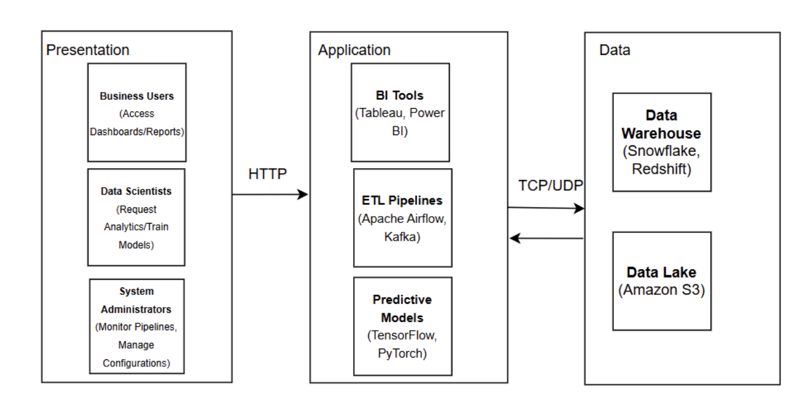
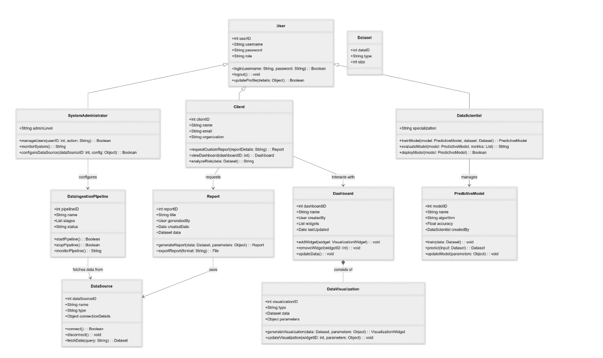
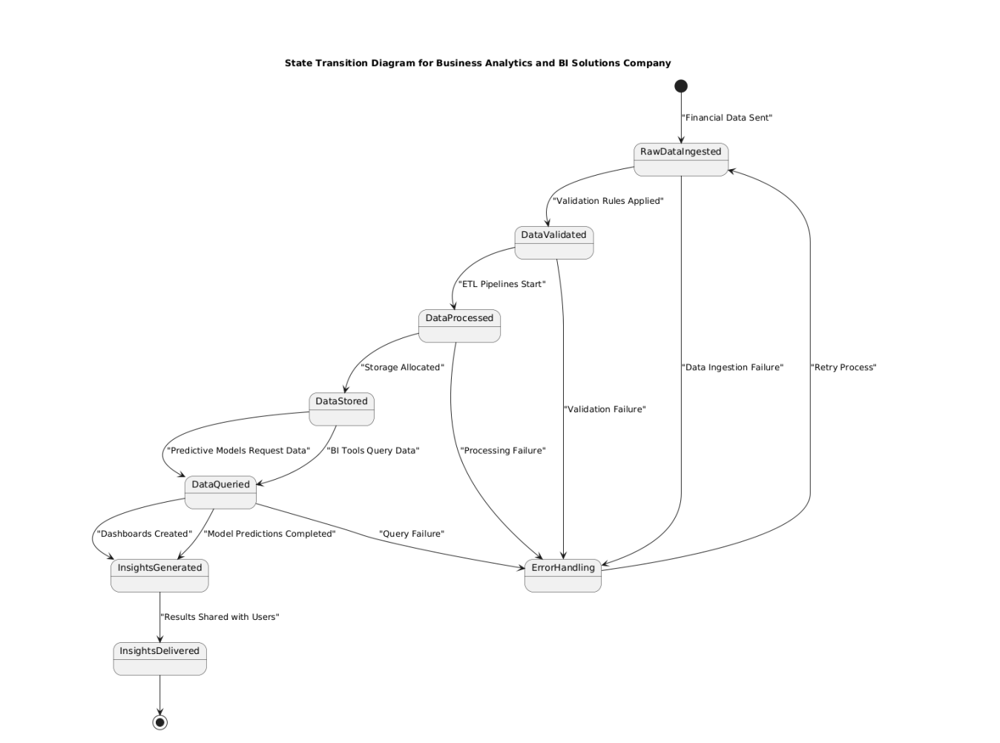
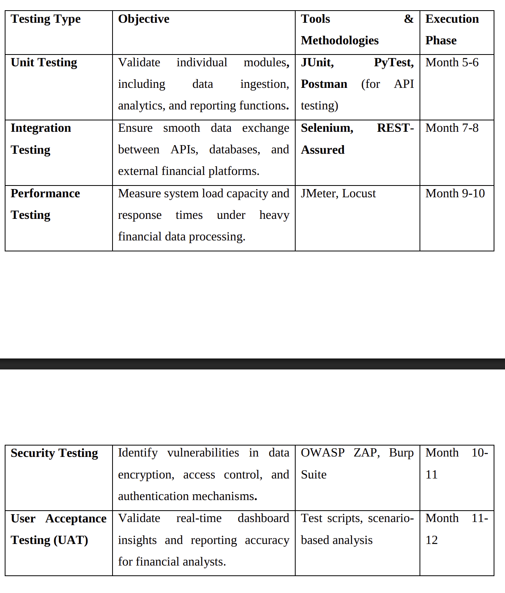
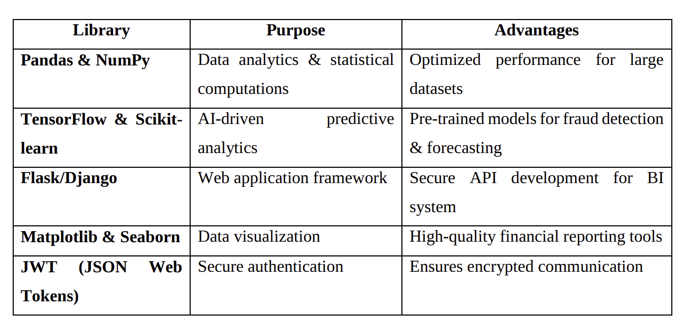
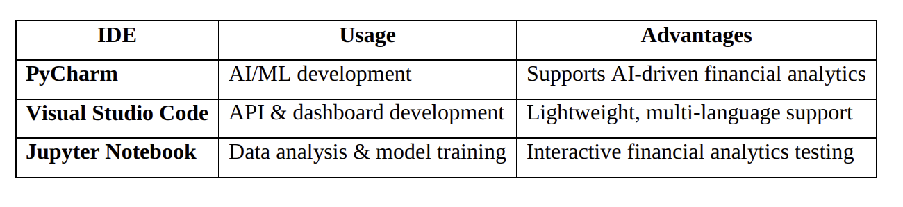

Documentation Structure Plan

1. Introduction
   1.1 Goal
   1.2 Objectives
2. Description of the Model
   2.1 Data Ingestion & Integration
   2.2 Data Storage & Management
   2.3 AI-Driven Insights & Predictive Analytics
   2.4 Business Intelligence & Visualization
   2.5 Security & Compliance
3. Approach: Software Development Models
   3.1 Comparison of Development Models
   3.2 Selected Model
   3.3 Alternative Approach
   3.4 Justification for Not Choosing Other Models
   3.5 Model Benefits
   3.6 Benefits of the Selected Model
4. Methodologies
   4.1 Comparison of Software Development Methodologies
   4.1.1 Comparison Table of Methodologies
   4.2 Selected Methodology
   4.2.1 Benefits
5. Constraints
   5.1 Technical Constraints
   5.2 Security & Compliance Constraints
   5.3 Organizational & Cost Constraints
6. Quality Attributes
   6.1 Key Attributes (Extensibility, Maintainability, Security and Compliance, Scalability, Reliability and Performance)
   6.2 DevOps
7. Diagrams
   7.1 Use Case Diagram
   7.2 Architecture Diagram
   7.3 Class Diagram
   7.4 State Transition Diagram
8. Plans for Implementation
   8.1 Implementation Plan
   8.1.1 Overview
   8.1.2 Phased Implementation Approach
   8.1.3 Expected Deliverables
   8.2 Testing Plan
   8.2.1 Testing Framework & Execution Strategy
   8.2.2 Expected Outcomes
   8.3 Documentation Plan
   8.3.1 Documentation Categories
   8.4 Integration (Development + Testing) Plan
   8.5 Maintenance Plan
   8.6 Business Plan
9. Object-Oriented Design Patterns
   9.1 Introduction
   9.2 Key OOP Design Patterns (Singleton, Factory, Observer, Strategy, Decorator, Adapter)
10. Strategic Reuse
    10.1 Code Modules
    10.2 External Libraries
    10.3 Documentation
    10.4 Version Control
    10.5 Integrated Development Environment (IDE)
    10.6 Database Structure
    10.7 Other Artifacts
    10.8 ROI Calculation, Future Development, and Reuse for Other Customers
11. Notes on Flaws and Improvements

---

## 1. Introduction

### 1.1 Goal

The primary goal of the RestoSam system is to revolutionize the restaurant dining experience by eliminating traditional pain points such as long waits for service, inefficient table booking, and suboptimal food ordering processes. The system aims to provide a seamless, technology-driven solution that enhances customer satisfaction while improving operational efficiency for restaurants.

### 1.2 Objectives

The objectives of the RestoSam system include streamlining restaurant operations through automated processes for food ordering, payment processing, and waiter notification systems to reduce wait times and improve service quality. The system aims to enhance customer experience by enabling customers to pre-order food and book tables in advance, view interactive restaurant maps, access multimedia menus, and receive personalized recommendations based on their preferences. Resource management is optimized through systems for automatic order reassignment to minimize food waste and provide real-time table availability management. The system is designed to handle 150+ concurrent users per restaurant during peak hours, with the ability to scale from 1 restaurant at launch to 10 restaurants within several months. Security and compliance are maintained through robust measures and adherence to Russian payment systems and accessibility standards. Finally, the system facilitates business intelligence through analytics dashboards and preference mapping systems to help restaurants make data-driven decisions and provide personalized customer experiences.

---

## 2. Description of the Model

### 2.1 Data Ingestion & Integration

The RestoSam system employs a comprehensive data ingestion pipeline that collects data from multiple sources including customer data such as user profiles, order history, preferences, and behavioral patterns collected through mobile and web applications. Restaurant data includes menu items, pricing, availability, table layouts, and operational metrics from restaurant management systems. Payment data consists of transaction records from integrated payment providers such as SBP, Mir, Visa, and other Russian banking systems. Real-time data includes live table availability, order status updates, and waiter notifications. Third-party APIs provide integration with mapping services and social media platforms for enhanced functionality. Data integration is achieved through RESTful APIs and gRPC protocols, ensuring real-time synchronization across all system components.

### 2.2 Data Storage & Management

The system utilizes a hybrid data storage architecture with PostgreSQL serving as the primary database for structured data including user accounts, orders, restaurant information, and transactional data. MongoDB provides flexible storage for menu items, customer preferences, and multimedia content. Redis serves as the cache layer for high-performance caching of frequently accessed data such as table availability and menu items. Automated backup systems, data validation, and integrity checks ensure data consistency and reliability.

### 2.3 AI-Driven Insights & Predictive Analytics

The system incorporates machine learning algorithms to provide intelligent recommendations through preference mapping that tracks user behavior to create detailed preference profiles based on order history, ratings, and interaction patterns. The recommendation engine offers AI-powered suggestions for food items based on past orders, dietary preferences, and seasonal availability. Predictive analytics enables forecasting of restaurant occupancy, popular menu items, and optimal staffing levels. Dynamic menu adaptation provides real-time menu updates based on ingredient availability and customer demand patterns.

### 2.4 Business Intelligence & Visualization

Business intelligence capabilities include comprehensive reporting tools for restaurant administrators to track performance metrics, customer behavior, and operational efficiency. Interactive visualizations display revenue trends, popular dishes, peak hours, and customer demographics. Real-time monitoring provides live dashboards showing current table occupancy, order status, and service performance. Custom reporting enables flexible report generation for business planning and decision-making.

### 2.5 Security & Compliance

The security framework encompasses multi-factor authentication with support for email/password and social media login through Yandex and Google. Payment security ensures compliance with PCI DSS standards and integration with secure Russian payment systems. Data encryption provides end-to-end encryption for sensitive customer data and payment information. Access control implements role-based access for different user types including customers, restaurant staff, and administrators. Audit logging provides comprehensive logging of all system activities for compliance and security monitoring.

---

## 3. Approach: Software Development Models

### 3.1 Comparison of Development Models

| Model         | Time | Quality | Cost | Docs | Extens. | Scale | Sec/Comp | Total | Avg           |
| ------------- | ---- | ------- | ---- | ---- | ------- | ----- | -------- | ----- | ------------- |
| Build-and-Fix | 6    | 3       | 3    | 1    | 3       | 2     | 2        | 20    | **2.9** |
| Waterfall     | 3    | 6       | 4    | 9    | 4       | 5     | 7        | 38    | **5.4** |
| Spiral        | 5    | 8       | 4    | 8    | 7       | 7     | 8        | 47    | **6.7** |
| Incremental   | 8    | 9       | 7    | 7    | 9       | 8     | 9        | 57    | **8.1** |
| Rapid Proto.  | 9    | 7       | 6    | 5    | 6       | 6     | 6        | 45    | **6.4** |

Abbrev: Docs = Documentation, Extens. = Extensibility, Scale = Scalability, Sec/Comp = Security & Compliance; scores 0–10 (higher is better).

The comparison shows that Incremental provides high flexibility with changes between increments, risks addressed per increment, testing after each increment, regular customer feedback, moderate documentation, and fast time‑to‑market for a working MVP—making it the best fit for RestoSam. Waterfall offers clear, document‑driven discipline but low flexibility, testing largely at the end, and longer time to market; it is suitable when requirements are fixed and compliance documentation is paramount. Spiral emphasizes strong risk management and high quality via iterative elaboration, but adds process overhead and cost, so it fits large internal projects with high risk. Rapid Prototyping validates requirements very quickly and aligns to customer needs early, but it can encourage throwaway or shortcut code and lighter documentation, which may hurt maintainability and compliance if not controlled. Build‑and‑Fix may be fast for trivial tasks, but it is unsuitable for a non‑trivial, compliant system due to poor documentation, quality, and security control.

### 3.2 Selected Model

The Incremental Development Model has been selected for the RestoSam project.

### 3.3 Alternative Approach

An alternative approach would be the Waterfall Model, which follows a sequential design process where progress flows downward through phases like conception, initiation, analysis, design, construction, testing, implementation, and maintenance.

### 3.4 Justification for Not Choosing Other Models

The Waterfall Model was not selected because it requires complete requirements upfront, which is challenging for restaurant systems where user needs frequently change. Testing only occurs at the end of development, increasing risk of major issues. No working software is delivered until the final phase, delaying business value realization. Changes are expensive and difficult to implement once a phase is complete.

### 3.5 Model Benefits

The Incremental Model provides several advantages including early delivery of value where basic functionality like table booking and ordering can be deployed early. Risk reduction occurs as issues are identified and resolved in smaller increments. Flexibility allows changes to be incorporated based on user feedback. Stakeholder satisfaction is maintained through regular deliveries that keep engagement and allow for course corrections.

### 3.6 Benefits of the Selected Model

The selected Incremental Model provides business value as restaurants can start using core booking functionality while additional features are developed. Quality assurance is ensured as each increment undergoes testing, guaranteeing quality at every stage. The model accommodates the dynamic nature of restaurant operations and customer preferences through adaptability. Cost control is achieved as budget and resources can be allocated more efficiently across increments.

---

## 4. Methodologies

### 4.1 Comparison of Software Development Methodologies

#### 4.1.1 Comparison Table of Methodologies

##### (a) RUP

| Parameter                        | Score (1 to 5) | Justification                                                                                          |
| -------------------------------- | -------------- | ------------------------------------------------------------------------------------------------------ |
| Flexibility and Adaptability     | 3              | Well-structured and adaptable through phases, but heavier governance slows changes compared to Agile.  |
| Documentation Management         | 5              | Emphasizes comprehensive artifacts (vision, SRS, architecture docs), ideal for auditability.           |
| Handling Regulatory Requirements | 5              | Phase gates and required evidence support PCI DSS and security controls.                               |
| Team Collaboration               | 3              | Clear roles/processes support collaboration, but ceremony is higher and slower for a 6–9 person team. |

##### (b) Scrum

| Parameter                        | Score (1 to 5) | Justification                                                                                              |
| -------------------------------- | -------------- | ---------------------------------------------------------------------------------------------------------- |
| Flexibility and Adaptability     | 5              | Time-boxed sprints and backlog refinement handle changing restaurant requirements and MVP evolution.       |
| Documentation Management         | 3              | Just-enough documentation; compliance needs can be covered via Definition of Done templates.               |
| Handling Regulatory Requirements | 4              | DevSecOps in the sprint (threat modeling, SAST/DAST, evidence in tickets) supports PCI DSS integrations.   |
| Team Collaboration               | 5              | Strong roles (PO, SM, Dev Team), frequent ceremonies, and transparency fit the 6–9 cross-functional team. |

##### (c) XP

| Parameter                        | Score (1 to 5) | Justification                                                                                            |
| -------------------------------- | -------------- | -------------------------------------------------------------------------------------------------------- |
| Flexibility and Adaptability     | 5              | Embraces change with continuous planning and small releases.                                             |
| Documentation Management         | 2              | Prefers code and tests over documents; may be insufficient for compliance trails.                        |
| Handling Regulatory Requirements | 3              | High engineering rigor (TDD, CI) helps quality, but lacks required documentation by default.             |
| Team Collaboration               | 4              | Pair programming and on-site customer improve feedback, but may stress availability and team preference. |

##### (d) Kanban

| Parameter                        | Score (1 to 5) | Justification                                                                               |
| -------------------------------- | -------------- | ------------------------------------------------------------------------------------------- |
| Flexibility and Adaptability     | 4              | Continuous flow with WIP limits adapts well, but lacks sprint cadence for fixed milestones. |
| Documentation Management         | 3              | Process-light; docs discipline must be enforced externally.                                 |
| Handling Regulatory Requirements | 3              | Can include compliance checks in the workflow, but provides fewer built-in control points.  |
| Team Collaboration               | 4              | Visual boards and pull-based work enhance collaboration; roles are lightweight.             |

#### Overall Methodology Ratings

| Methodology | Pros                                                                                                        | Cons                                                                          | Final Score    |
| ----------- | ----------------------------------------------------------------------------------------------------------- | ----------------------------------------------------------------------------- | -------------- |
| RUP         | - Strong documentation and governance - Excellent for regulated environments and audit trails          | - Heavier process for a 6–9 team - Slower to adapt, higher overhead     | **4.0**  |
| Scrum       | - Highest adaptability and focus on working increments - Excellent team collaboration and transparency | - Requires discipline to maintain compliance documentation within sprints     | **4.25** |
| XP          | - Strong engineering practices (TDD, refactoring, CI) improve quality - Rapid feedback                 | - Minimal documentation and on-site customer expectations may not be feasible | **3.5**  |
| Kanban      | - Great visibility and flow; ideal for ops/maintenance and continuous delivery                              | - Lacks time-boxing; weaker for fixed milestones without additional structure | **3.5**  |

Taken together, Scrum best matches RestoSam’s needs: a small cross‑functional team delivering a working MVP quickly, adapting to changing restaurant and payment requirements, and integrating DevSecOps activities each sprint to satisfy PCI‑DSS and security evidence. RUP remains a viable choice when auditability must dominate, but its ceremony would slow early iterations. XP provides superb code quality but its documentation lightness and on‑site customer expectations are less practical here. Kanban complements Scrum for production support and DevOps flow but, by itself, offers less predictability for milestone‑driven delivery.

### 4.2 Selected Methodology

Scrum has been selected as the primary software development methodology for the RestoSam project.

#### 4.2.1 Benefits

The benefits of Scrum include adaptive planning through time-boxed sprints of 2-4 weeks that allow the team to adapt to changing restaurant requirements and customer feedback. Clear roles and responsibilities are provided through distinct roles including Product Owner, Scrum Master, and Development Team ensuring accountability and efficient decision-making. Incremental delivery is achieved through regular sprint deliveries that ensure working software increments providing immediate business value to restaurant operations. Transparency is maintained through daily stand-ups, sprint reviews, and retrospectives for continuous improvement. The methodology supports cross-functional teams with the diverse skill set required for frontend, backend, mobile, DevOps, and QA development in a multi-platform restaurant system. Risk management is enhanced through short sprints and frequent feedback loops that help identify and mitigate risks early in the development process.

---

## 5. Constraints

### 5.1 Technical Constraints

The technical constraints include payment integration that must work with Russian payment systems such as SBP, Mir, Visa, and major banking providers. Platform support requires native iOS and Android apps, responsive web interface, and web-based admin dashboard. Real-time processing is essential for handling order updates, table booking changes, and waiter notifications. The architecture must support 150+ concurrent users per restaurant during peak hours. Third-party API restrictions require all APIs to be accessible from Russia with appropriate localization. Performance requirements demand response time optimization for mobile networks and varying internet speeds. Data synchronization must occur in real-time across mobile, web, and backend systems.

### 5.2 Security & Compliance Constraints

Security and compliance constraints include data protection compliance with Russian regulations and international standards. Payment security requires PCI DSS compliance for handling payment information. User privacy demands secure handling of personal data, location information, and payment details. Access control implements role-based permissions for customers, restaurant staff, and administrators. Audit requirements necessitate comprehensive logging for regulatory compliance and security monitoring. Encryption standards require end-to-end encryption for sensitive data transmission and storage.

### 5.3 Organizational & Cost Constraints

Organizational and cost constraints include a team size of 6-9 members with specific roles such as Team Lead, Scrum Master, Product Manager, Web Frontend, 2 Backend developers, Mobile developer, DevOps, SRE, and QA. The timeline requires launching with 1 restaurant and scaling to 10 restaurants within several months. Budget limitations require a cost-effective technology stack while maintaining quality and scalability. The business culture demands an innovative environment with low bureaucracy requiring agile decision-making. Resource availability is limited for specialized talent in restaurant technology domain. Market competition requires differentiation from existing restaurant booking and ordering systems.

---

## 6. Quality Attributes

### 6.1 Key Attributes

Extensibility is a critical quality attribute where the system architecture supports easy addition of new features and integrations through modular design allowing independent development of mobile, web, and backend components. Plugin architecture supports payment providers and third-party services. API-first design enables future integrations such as delivery services and loyalty programs. Maintainability is ensured through clean code practices with comprehensive documentation, automated testing suites ensuring reliability during updates, version control and CI/CD pipelines for continuous deployments, and modular architecture reducing coupling between components. Security and compliance include multi-factor authentication and secure session management, encrypted data transmission and storage, regular security audits and compliance monitoring, and role-based access control with principle of least privilege. Scalability provides horizontal scaling capability from 1 to 10+ restaurants, microservices architecture supporting independent scaling of components, database sharding and caching strategies for performance, and load balancing and auto-scaling capabilities. Reliability and performance maintain 99.9% uptime requirement for restaurant operations, response times under 2 seconds for critical operations, fault-tolerant design with automatic failover mechanisms, and performance monitoring and alerting systems.

### 6.2 DevOps

The DevOps implementation includes continuous integration through automated build and testing pipelines. Continuous deployment provides automated deployment to staging and production environments. Infrastructure as code ensures version-controlled infrastructure definitions. Monitoring and logging provide comprehensive application and infrastructure monitoring. Security integration implements DevSecOps practices with automated security scanning. Collaboration is achieved through cross-functional team practices and shared responsibility for quality.

---

## 7. Diagrams

### 7.1 Use Case Diagram

This use case diagram shows three actors (Guest, Kitchen, Administrator) and their interactions with the system. Guests browse restaurants, sign up/sign in, book tables and manage bookings, pay for orders (with credit card and payment-system options as extensions of the core payment use case), leave reviews, get advice on choosing dishes, and receive status notifications such as “order in process” and “order is ready.” Kitchen staff take and view orders, update statuses and mark orders ready (triggering readiness notifications), and manage ingredient availability by marking menu items unavailable and planning stock based on pre‑order notifications. Administrators maintain the room layout, menu, prices and working time, resolve controversial cases, and track KPIs. Associations indicate who performs which actions, while include/extend relationships show payment options and the notification flow attached to order management.

### 7.2 Architecture Diagram

TODO: ADD IMAGE

The system follows a microservices architecture with a frontend layer consisting of React or Vue.js web application and React Native mobile applications for iOS and Android. The API Gateway handles request routing and authentication with rate limiting and security. Microservices include User Management Service, Order Management Service, Restaurant Management Service, Payment Service, Notification Service, and Recommendation Engine Service. The data layer uses PostgreSQL for primary data, MongoDB for documents and media, and Redis for caching and sessions. Infrastructure includes Docker containers, Kubernetes orchestration, and cloud deployment on AWS or GCP.

### 7.3 Class Diagram

TODO: ADD IMAGE

The Class Diagram shows core classes including User with subclasses Customer, Admin, and Staff, Restaurant, Table, Order, MenuItem, Payment, and Notification. Key relationships show User places Order, Order contains MenuItems, Restaurant has Tables, Table belongs to Restaurant, Order associated with Payment, and User receives Notifications. Design patterns include Factory Pattern for Order creation, Observer Pattern for real-time updates, and Strategy Pattern for payment processing.

### 7.4 State Transition Diagram

TODO: ADD IMAGE

The State Transition Diagram shows Order States progressing from Created to Paid to Accepted by Kitchen to Being Prepared to Ready to Delivered to Table to Completed. Table States transition from Available to Reserved to Occupied to Needs Cleaning back to Available. User Session States move from Anonymous to Authenticated to Active Session to Session Expired. Payment States progress from Initiated to Processing to Completed or Failed/Refunded.

---

## 8. Plans for Implementation

### 8.1 Implementation Plan

#### 8.1.1 Overview

The implementation follows an incremental approach with Scrum methodology, delivering working software every 2-4 weeks. The project spans 6-9 months from initiation to full deployment across 10 restaurants.

#### 8.1.2 Phased Implementation Approach

Phase 1 focuses on Foundation during weeks 1-8 with user authentication and profile management, basic restaurant and menu display, and table availability viewing. Phase 2 covers Core Functionality during weeks 9-20 including order placement and payment processing, real-time table booking, and basic notification system. Phase 3 develops Advanced Features during weeks 21-32 with AI recommendation engine, interactive restaurant maps, and waiter calling system. Phase 4 handles Optimization and Scale during weeks 33-44 including performance optimization, multi-restaurant support, and analytics dashboard.

#### 8.1.3 Expected Deliverables

Expected deliverables include functional MVP with core booking and ordering features, complete mobile and web applications, restaurant management dashboard, integrated payment system, and comprehensive documentation and training materials.

### 8.2 Testing Plan

#### 8.2.1 Testing Framework & Execution Strategy

TODO: ADD TABLE

Testing types include Unit Testing with Jest for frontend and JUnit for backend, Integration Testing with API testing through Postman and Newman, End-to-End Testing with Cypress for web and Appium for mobile, Performance Testing using JMeter for load testing, and Security Testing with OWASP ZAP and manual penetration testing. The testing strategy employs Test-Driven Development for critical business logic, automated testing in CI/CD pipeline, manual testing for user experience validation, and performance testing with 150+ concurrent users simulation.

#### 8.2.2 Expected Outcomes

Expected outcomes include code coverage greater than 80%, zero critical bugs in production, performance benchmarks met with response time under 2 seconds, security vulnerabilities addressed, and user acceptance criteria satisfied.

### 8.3 Documentation Plan

#### 8.3.1 Documentation Categories

Documentation categories include technical documentation with API specifications, architecture diagrams, and database schemas. User documentation covers user guides, FAQ, and video tutorials. Administrator documentation includes setup guides, configuration manuals, and troubleshooting. API documentation provides Swagger and OpenAPI specifications. Code documentation contains inline comments, README files, and architecture decision records.

### 8.4 Integration (Development + Testing) Plan

The integration plan combines development and testing activities through continuous integration with automated builds and tests on every commit. Staging environment provides pre-production testing environment mirroring production. Feature flags enable gradual feature rollout and A/B testing capabilities. Rollback procedures include automated rollback mechanisms for failed deployments. Monitoring integration provides real-time monitoring and alerting during deployment.

### 8.5 Maintenance Plan

The maintenance plan includes regular updates with monthly feature updates and security patches. Bug fixes provide 24/7 monitoring with 4-hour response time for critical issues. Performance monitoring ensures continuous performance tracking and optimization. User support offers multi-channel support through chatbot, email, and phone. Scalability planning includes capacity planning and infrastructure scaling. Technology updates involve regular assessment of technology stack and migration planning.

### 8.6 Business Plan

The business plan includes revenue model with commission on orders, premium restaurant subscriptions, and advertising. Market expansion starts with 1 restaurant and scales to 10 within months. Customer acquisition uses referral programs and partnerships with restaurants. Competitive advantage comes from AI recommendations, interactive maps, and seamless experience. ROI timeline shows break-even within 6 months and profitability within 12 months.

---

## 9. Object-Oriented Design Patterns

### 9.1 Introduction

The RestoSam system leverages object-oriented design patterns to ensure maintainable, extensible, and reusable code. Patterns are selected based on the system's requirements for scalability, flexibility, and clean architecture.

### 9.2 Key OOP Design Patterns

The Singleton Pattern is used for database connection management, configuration management, and logging services. Implementation ensures single instance of critical system components. Benefits include preventing resource conflicts and ensuring consistent state. The Factory Pattern is used for order creation, payment processor instantiation, and notification service creation. Implementation provides abstract factory for creating different types of orders and payment methods. Benefits include decoupling object creation from usage and supporting multiple payment providers. The Observer Pattern is used for real-time order updates, table availability notifications, and waiter call system. Implementation provides event-driven architecture for real-time updates across system components. Benefits include loose coupling between subjects and observers and real-time data synchronization. The Strategy Pattern is used for payment processing, recommendation algorithms, and pricing strategies. Implementation provides interchangeable algorithms for different payment providers and recommendation engines. Benefits include runtime algorithm switching and easy addition of new strategies. The Decorator Pattern is used for menu item customization, user permission enhancement, and logging enhancement. Implementation provides dynamic addition of responsibilities to objects without subclassing. Benefits include flexible feature addition and avoiding class explosion. The Adapter Pattern is used for third-party API integration, legacy system integration, and payment gateway abstraction. Implementation provides interface adaptation for different payment providers and external services. Benefits include integration with incompatible interfaces and future-proofing against API changes.

---

## 10. Strategic Reuse

### 10.1 Code Modules

Reusable components include authentication module with OAuth2 and JWT handling, payment processing abstraction layer, notification system for email, SMS, and push notifications, image processing and optimization utilities, caching abstraction layer, and logging and monitoring utilities. Benefits include consistent implementation across platforms, reduced development time, and easier maintenance.

### 10.2 External Libraries

TODO: ADD TABLE

Frontend libraries include React or Vue.js for web interface, React Native for mobile applications, Axios for HTTP client, and Redux or Zustand for state management. Backend libraries include Spring Boot for Java services, Express.js for Node.js services, and gRPC for inter-service communication. Database and caching libraries include PostgreSQL drivers, MongoDB client libraries, and Redis client libraries. DevOps libraries include Docker for containerization, Kubernetes for orchestration, and Jenkins or GitLab CI for automation.

### 10.3 Documentation

Reusable documentation includes API documentation templates, code commenting standards, architecture decision records, testing guidelines and templates, and deployment and configuration guides.

### 10.4 Version Control

Git workflow includes feature branch workflow, pull request reviews, automated CI/CD pipelines, semantic versioning, and Git tagging for releases. Benefits include code traceability, collaborative development, and automated quality checks.

### 10.5 Integrated Development Environment (IDE)

TODO: ADD TABLE

Development environment includes Visual Studio Code with extensions, IntelliJ IDEA for Java development, Xcode for iOS development, and Android Studio for Android development. Standardized configuration includes ESLint and Prettier for code formatting, EditorConfig for consistent formatting, and pre-commit hooks for code quality.

### 10.6 Database Structure

Reusable database components include user authentication tables, audit logging tables, common lookup tables, standardized naming conventions, and migration scripts and templates.

### 10.7 Other Artifacts

Testing artifacts include test data generators, mock services for testing, performance testing scripts, and automated test suites. Deployment artifacts include infrastructure as code templates, configuration management scripts, monitoring and alerting configurations, and backup and recovery procedures.

### 10.8 ROI Calculation, Future Development, and Reuse for Other Customers

ROI analysis shows development cost savings of 40% through reusable components, time-to-market reduction of 30% for similar restaurant projects, maintenance cost reduction of 50% through standardized patterns, and quality improvement with 60% defect reduction through established practices. Future development opportunities include delivery integration module, loyalty program expansion, multi-language support framework, and advanced analytics dashboard. Reuse for other customers includes white-label restaurant platform, customizable feature modules, standardized API interfaces, pre-built integration connectors, and comprehensive documentation package.

---

## 11. Notes on Flaws and Improvements

### Current System Limitations

Current system limitations include single restaurant focus where initial implementation supports only one restaurant requiring significant re-architecture for multi-restaurant support. Limited AI capabilities with basic recommendation engine lacking advanced machine learning for complex preference analysis. Payment provider constraints restricted to Russian payment systems limiting international expansion. Real-time synchronization with potential latency issues in high-concurrency scenarios across distributed systems. Mobile-first design where web interface may have limited functionality compared to native mobile apps.

### Recommended Improvements

Recommended improvements include microservices evolution transitioning to full microservices architecture for better scalability and independent deployments. Advanced AI integration implementing more sophisticated machine learning models for personalized recommendations and demand forecasting. Global payment support expanding payment provider support for international markets. Edge computing implementation for reduced latency in real-time features. Progressive web app enhancement to provide app-like experience with offline capabilities. Blockchain integration consideration for transparent order tracking and loyalty programs. IoT integration adding support for smart kitchen equipment and automated inventory management. Sustainability features implementing carbon footprint tracking and sustainable dining recommendations.

### Risk Mitigation Strategies

Risk mitigation strategies include technology debt management through regular refactoring and technology stack evaluation. Security enhancement with continuous security audits and compliance monitoring. Performance optimization through regular performance testing and infrastructure scaling. User feedback integration with continuous user research and feature prioritization. Competitive analysis through regular market analysis and feature gap identification.

### Future Research Directions

Future research directions include AI-driven operations with advanced predictive analytics for restaurant operations. Voice interface integration using natural language processing for order placement. Augmented reality features for menu visualization and table selection. Sustainable technology with carbon-neutral operations and waste reduction algorithms. Social dining features for group ordering and social dining coordination.
